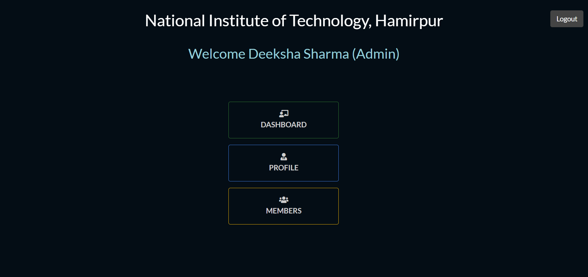
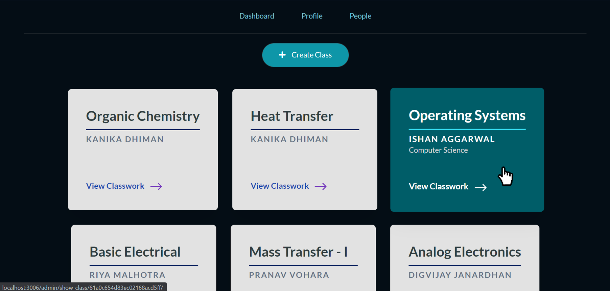

# Virtual Classroom
This is a web application which provides a platform for students to access educational resources from anywhere. 
An institution-level online platform that helps students and teachers to interact with each other in this pandemic.

### Setup

* Git Clone the Repo or download the Project Zip file.

```
git clone https://github.com/Deeksha2501/Virtual-Classroom-Engage21.git
```


* Extract the files in your desired folder.
* Create a .env file and add your credentials in it as given in .env.sample
* Go to the extracted folder and run command "npm install" to install all the required dependencies
* Start the development server by running command "npm start".

```
npm install
npm start
```


## Build With

This is Web Development Project based on Node. The tech stacks used are 
   * Node.js
   * Express.js(Framework)
   * MongoDB(Database)
   * Google Cloud Storage(For storing documents)
   * JavaScript
   * EJS Templates(For rendering)
   * CSS


## Features
The key features include

* Accessible and consistent User Interface
* User registration and email validation for the activation of their account.
* Quick and easy class creation and management by the admin of the institute.
* Personalizing the experience of the class by providing the theme image while creation.
* Automatic fetching of potential students for the class and inviting them via mail.
* Students can join the class by the clicking on the link mentioned in the mail sent by the admin.
* Teachers can upload coursework documents and curriculam in the class.
* Assignment creation by teacher and attachement of required documents for the same. 
* Easy assignment submission by the students.
* Grading of students based on the responses given by them.
* Students can check their grades for a particular assignement.
* Admin can announce any information to the class.
* Class centric Discussion Panel for students to discussing subjects and exchanging notes.
* Teachers can post and attach something to the discussion panel and can also interact with the students
* Report any student in case of any indiscipline, both admin and the reported student will be notified via email regarding the same.
* Admin can remove any student from the class or from the institute directly.
* Check profile of any member of the institute.
* Can check the students and faculties of the institute in members tab.

## User Specific Features and roles
An institute can register itself to the app and create an admin user for the same.

### Admin

* Creating classroom of a particular batch and branch, and assigning faculty to them.
* Providing theme image of the class while creating
* Inviting students to join a particular class via email.
* Announce any information or circular to the class.
* Viewing all classes of the institute and managing them at a single place
* Review all the classwork uploaded by Faculties 
* Check the status of the assignment given by the faculty and student submissions
* Can see the grades assigned to the student of a particular Assignment.
* Viewing all students who joined a particular classroom.
* Can upload profile Image.

### Teacher

* Viewing all class-cards at single place
* Uploading classwork and curriculam for the class.
* Assigning work to the students and attaching required documents for the same.
* Announce something to the class.
* Solve student doubts using discussion panel
* Posting class comments
* Viewing all student submissions for a particular assignment.
* Grading each student submission for a particular classwork.
* Reporting students to the admin in case of any indiscipline.
* Viewing all students who joined a particular classroom.
* Can upload profile Image.

### Student - 
* Joining classrooms clicking on the link given in the mail sent by the admin.
* Viewing all class-cards at single place.
* Access and download all your classwork material provided by the faculty.
* Posting class comments.
* Solve doubts using discussion panel
* Attach and share documents and notes with the class
* Uploading submission for the assignment given by the faculty.
* Checking grades assigned for a particular assignment.
* Viewing all Classmates and faculty of the class.
* Adding profile Image.


  
[The video demo for the project](https://www.youtube.com/watch?v=-WnWxI7arfI)


## Images

#### Admin

Homescreen looks like :


Admin Dashboard :



